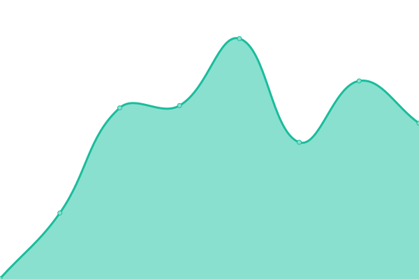
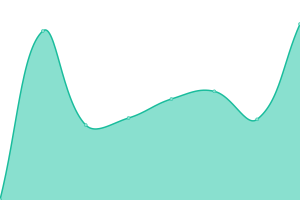
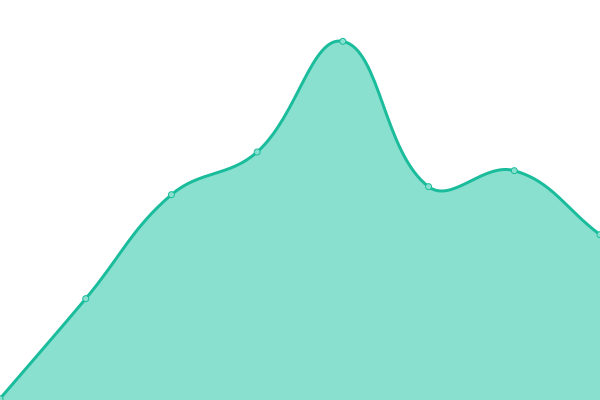
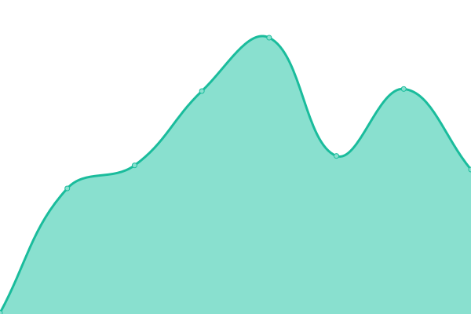
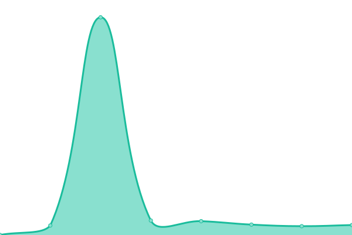

# [📈 Live Status](https://status.MKN7787.com): <!--live status--> **🟧 Partial outage**

This repository contains the open-source uptime monitor and status page for [Mike Henry](https://www.henrymike.com/), powered by [Upptime](https://github.com/upptime/upptime).

With [Upptime](https://upptime.js.org), you can get your own unlimited and free uptime monitor and status page, powered entirely by a GitHub repository. We use [Issues](https://github.com/mikemhenry/website-uptime/issues) as incident reports, [Actions](https://github.com/mikemhenry/website-uptime/actions) as uptime monitors, and [Pages](https://status.MKN7787.com) for the status page.

<!--start: status pages-->
<!-- This summary is generated by Upptime (https://github.com/upptime/upptime) -->
<!-- Do not edit this manually, your changes will be overwritten -->
<!-- prettier-ignore -->
| URL | Status | History | Response Time | Uptime |
| --- | ------ | ------- | ------------- | ------ |
|  [OMSF](https://www.omsf.io) | 🟩 Up | [omsf.yml](https://github.com/mikemhenry/website-uptime/commits/HEAD/history/omsf.yml) | 

 321ms
     
 | 

<a href="https://status.MKN7787.com/history/omsf">100.00%</a>
    

|  [OpenFE](https://openfree.energy) | 🟩 Up | [open-fe.yml](https://github.com/mikemhenry/website-uptime/commits/HEAD/history/open-fe.yml) | 

 372ms
     
 | 

<a href="https://status.MKN7787.com/history/open-fe">100.00%</a>
    

|  [Try OpenFE](https://try.openfree.energy) | 🟥 Down | [try-open-fe.yml](https://github.com/mikemhenry/website-uptime/commits/HEAD/history/try-open-fe.yml) | 

 0ms
     
 | 

<a href="https://status.MKN7787.com/history/try-open-fe">0.00%</a>
    

|  [OpenFF](https://openforcefield.org) | 🟩 Up | [open-ff.yml](https://github.com/mikemhenry/website-uptime/commits/HEAD/history/open-ff.yml) | 

 207ms
     
 | 

<a href="https://status.MKN7787.com/history/open-ff">100.00%</a>
    

|  [Alchemiscale (API)](https://api.alchemiscale.org/ping) | 🟩 Up | [alchemiscale-api.yml](https://github.com/mikemhenry/website-uptime/commits/HEAD/history/alchemiscale-api.yml) | 

 263ms
     
 | 

<a href="https://status.MKN7787.com/history/alchemiscale-api">100.00%</a>
    

|  [Alchemiscale (Compute)](https://compute.alchemiscale.org/ping) | 🟩 Up | [alchemiscale-compute.yml](https://github.com/mikemhenry/website-uptime/commits/HEAD/history/alchemiscale-compute.yml) | 

 257ms
     
 | 

<a href="https://status.MKN7787.com/history/alchemiscale-compute">100.00%</a>
    

<!--end: status pages-->

[**Visit our status website →**](https://status.MKN7787.com)

## 📄 License

- Powered by: [Upptime](https://github.com/upptime/upptime)
- Code: [MIT](./LICENSE) © [Mike Henry](https://www.henrymike.com/)
- Data in the `./history` directory: [Open Database License](https://opendatacommons.org/licenses/odbl/1-0/)
